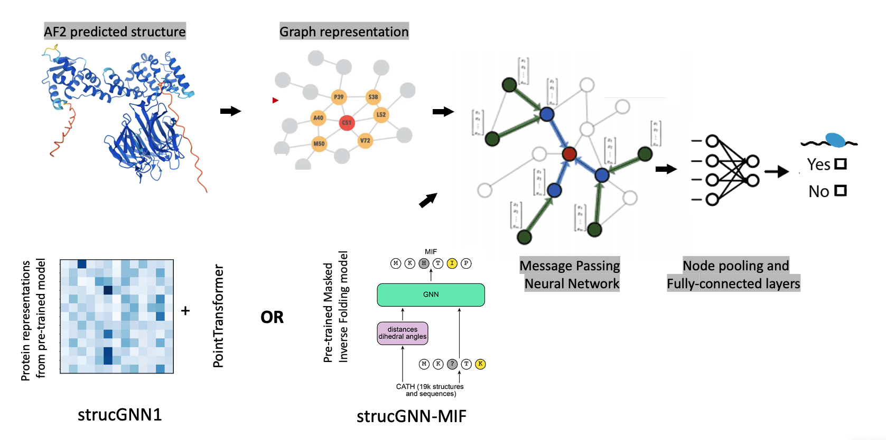
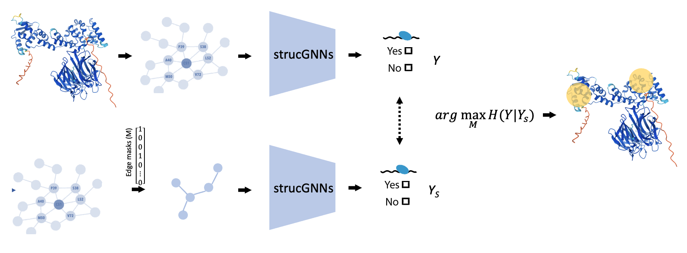

# strucGNN-RBP: structure-based modelling of RNA-binding proteins using graph neural networks.

## strucGNNs
strucGNNs are graph neural network-based frameworks for predicting RNA-binding protein and RNA-binding domain from protein structure data.

## Interpreting strucGNNs for RNA-binding domain discovery

